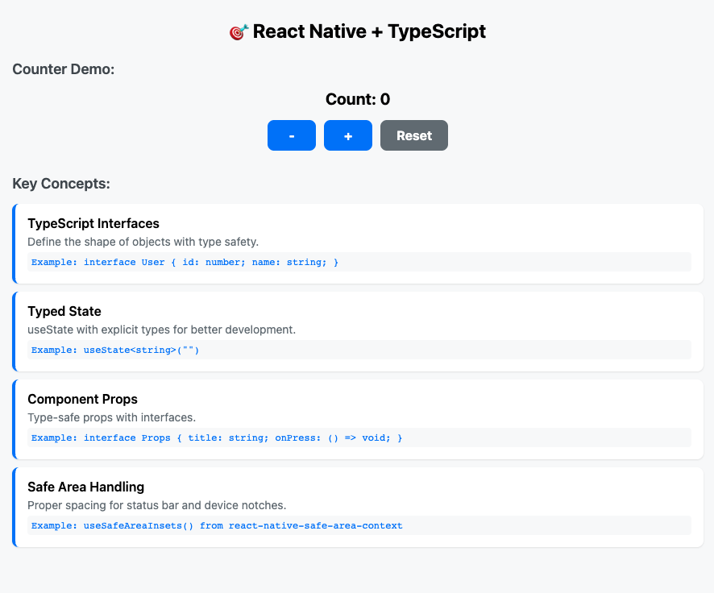

# react-native-typescript-architecture

A comprehensive React Native TypeScript application built for learning core concepts and interview preparation.

## 🚀 Features

- **TypeScript Integration** - Full type safety throughout the app
- **Tab Navigation** - Clean tab-based navigation using Expo Router
- **Counter Demo** - State management with custom hooks
- **Todo List** - CRUD operations with local state
- **Safe Area Handling** - Proper spacing for all device types
- **Modern UI** - Clean, professional interface

## 📱 Screenshots




## 🛠️ Technologies Used

- React Native
- TypeScript
- Expo Router
- React Native Safe Area Context
- FontAwesome Icons

## 📦 Installation

```bash
# Clone the repository
git clone https://github.com/YOUR_USERNAME/react-native-learning-app.git

# Navigate to project directory
cd react-native-learning-app

# Install dependencies
npm install

# Start the development server
npx expo start
```
